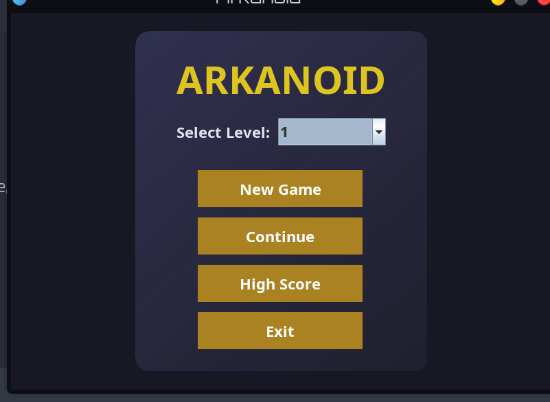
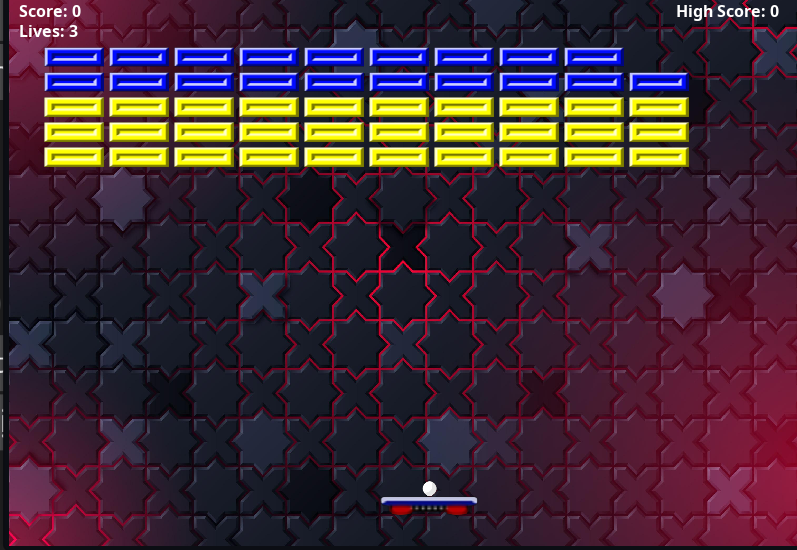
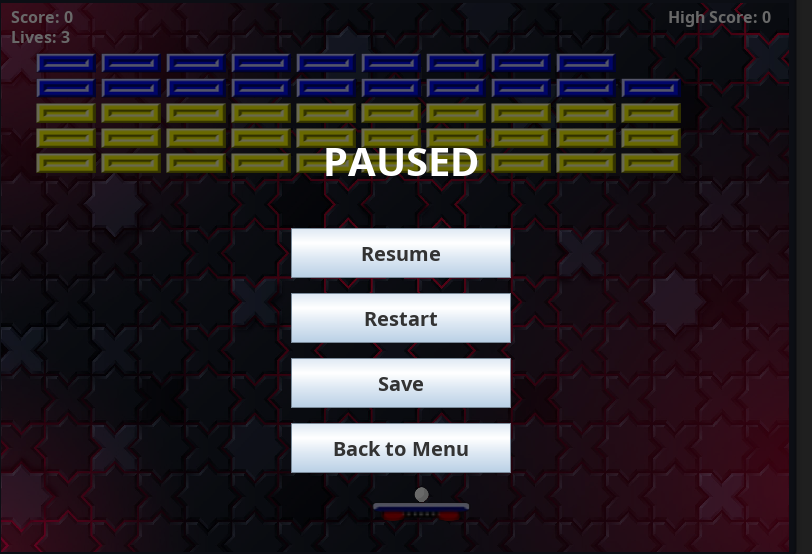

# BTLoop

##Author
Group "Chộ nào" - Class INT2204_11
1. Trần Nguyễn Bảo Anh - 24021377 - 25%
2. Nguyễn Hoàng Bảo - 24021385 - 25%
3. Phạm Quốc An - 24021353 - 25%
4. Nguyễn Tài Đức - 24021417 - 25%

**Instructor**: Kiều Văn Tuyên
**Semester**: HK1 - 2025

## Description
This is a classic Arkanoid game developed in Java as a final project for Object-Oriented Programming course. The project demonstrates the implementation of OOP principles and design patterns.
**Key features:**
1. The game is developed using Java 17+ with JavaFX/Swing for GUI.
2. Implements core OOP principles: Encapsulation, Inheritance, Polymorphism, and Abstraction.
3. Applies Factory method.
4. Includes sound effects, animations, and power-up systems.
5. Supports save/load game functionality.

### Screenshots
**Main Menu**  

**Ingame**

**PauseMenu**

### Controls
| Key | Action |
|-----|--------|
| `←` or `A` | Move paddle left |
| `→` or `D` | Move paddle right |
| `SPACE` | Launch ball |
|  `ESC` | Pause game |

## Installation

1. Clone the project from the repository.
2. Open the project in the IDE.
3. Run the project.
